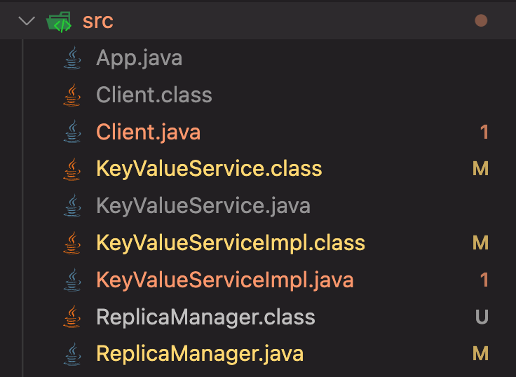
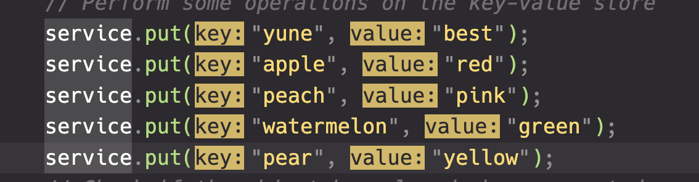
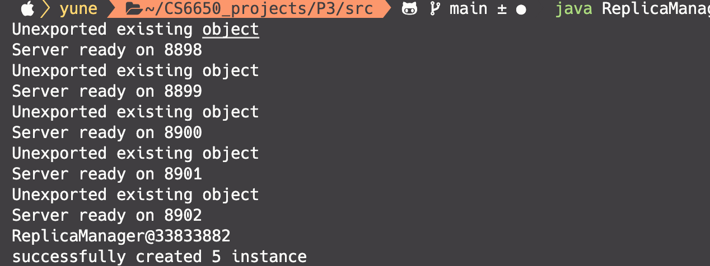
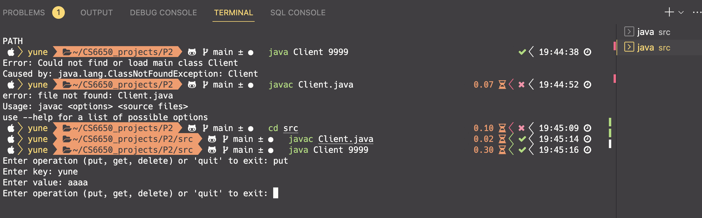
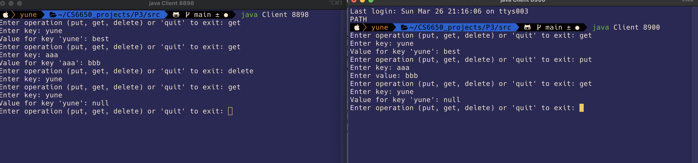

# Key-Value Pair Server and Client System using RMI

This is a simple key-value pair server and client system implemented using Remote Method Invocation (RMI) in Java. The system allows the client to perform CRUD (Create, Read, Update, Delete) operations on a key-value store by communicating with the server through RMI.

## Components

The system consists of two components:

1. ReplicaManager: Sets up a number of KeyValueService replicas and registers them with a Java RMI registry.

2. KeyValueService: This component provides the RMI service implementation of the key-value store. It receives requests from the client and performs the corresponding 2-Pharse commit operation on the key-value store.
3. Client: This component provides a command-line interface for the user to interact with the key-value store. The user can enter "put", "get", or "delete" to perform the corresponding operation, or "quit" to exit the system.

## Code

The server and client code are provided in separate Java classes as follows:

1. `KeyValueService`: This is the RMI service interface that defines the methods for performing CRUD operations on the key-value store.

2. `KeyValueServiceImpl`: This is the implementation of the `KeyValueService` interface. The key-value store uses a two-phase commit protocol to ensure consistency across replica nodes. When a client issues a put or delete command, the receiving replica node enters a "prepare" phase, in which it sends prepare messages to all other replica nodes to ensure they are ready to commit the update. If all replicas respond with an "OK" message, the replica node enters a "commit" phase, in which it sends commit messages to all other replica nodes to instruct them to commit the update.

3. `ReplicaManager`:The ReplicaManager class sets up multiple KeyValueService replica nodes on different ports, and registers them with a Java RMI registry. The Client class connects to one of the replica nodes and sends commands to it using the KeyValueService RMI interface.

4. `Client`: This is the main class for the client component. It uses the RMI registry to look up the `KeyValueService` RMI service implementation and provides a simple command-line interface to allow the user to perform CRUD operations on the key-value store.

## Usage

To use the system, follow these steps:

1. Compile the server and client code using the Java compiler.
   `javac ReplicaManager.java`
   `javac KeyValueService.java`
   `javac KeyValueServiceImpl.java`
   `javac Client.java`
   

2. Start the 5 replica server by running the ReplicaManager class. I added some preperation case in it.
   `java ReplicaManager `
   

   

3. Start the client by running the Client class. The port number you can choose includes 8898,8899,8900,8901,8902 .
   `java Client <portnumber>`

   
   

4. Follow the instructions on the command-line interface to perform 2-Phase Commit operations on the key-value store.

## Conclusion

This key-value pair server and client system using RMI provides a basic implementation of a distributed key-value store that using 2 Phase Commit. The system is thread-safe, and the server can handle multiple requests from multiple clients concurrently. However, this implementation does not provide any data persistence, and the key-value store will be lost if the server is shut down.
