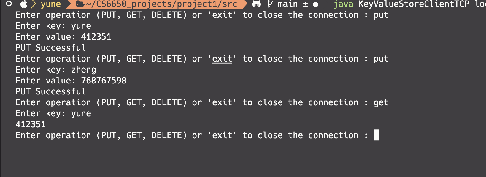

## Getting Started

Welcome to the VS Code Java world. Here is a guideline to help you get started to write Java code in Visual Studio Code.

## Folder Structure

The workspace contains two folders by default, where:

- `src`: the folder to maintain sources
- `lib`: the folder to maintain dependencies

Meanwhile, the compiled output files will be generated in the `bin` folder by default.

> If you want to customize the folder structure, open `.vscode/settings.json` and update the related settings there.

## Dependency Management

The `JAVA PROJECTS` view allows you to manage your dependencies. More details can be found [here](https://github.com/microsoft/vscode-java-dependency#manage-dependencies).

## how to run the code

first compile the java file
`javac KeyValueStoreClientTCP.java`
`javac KeyValueStoreServerTCP.java`
`javac KeyValueStoreClientUDP.java`
`javac KeyValueStoreServerUDP.java`

Run TCP server `java KeyValueStoreServerTCP <portnumber>`
Run TCP Cient `java KeyValueStoreServerTCP <server address> <portnumber>`

Run UDP server `java KeyValueStoreServerUDP <portnumber>`
Run UDP Cient `java KeyValueStoreServerUDP <server address> <portnumber>`

1.Input the operation

2. input key value pair

