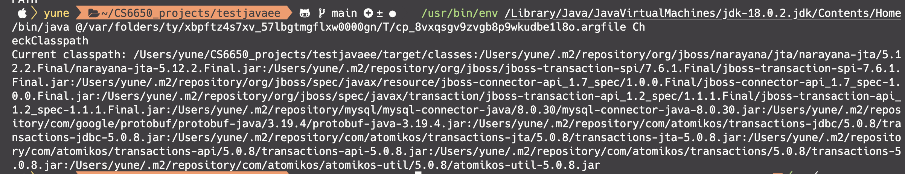

The output shows the current classpath used by your Java application. The classpath is a list of locations (directories, JAR files, or ZIP files) where the Java runtime looks for user-defined classes and libraries when loading and running Java applications. In this case, the classpath contains several directories and JAR files, separated by colons (:) since this is a Unix-like system (macOS or Linux).

Here's a breakdown of the individual components of your classpath:

/Users/yune/CS6650_projects/testjavaee/target/classes: This is a directory containing compiled classes of your Java project. It's usually created by build tools like Maven or Gradle when building a project.
/Users/yune/.m2/repository/...: These are various JAR files located in your local Maven repository (~/.m2/repository). These JAR files represent dependencies used by your Java application. Dependencies can include third-party libraries, database drivers, or other external components required by your application.
Here's a list of some notable JAR files in your classpath:

narayana-jta-5.12.2.Final.jar: Narayana JTA (Java Transaction API) implementation for managing transactions.
jboss-transaction-spi-7.6.1.Final.jar: JBoss Transaction SPI (Service Provider Interface) for working with transactions.
mysql-connector-java-8.0.30.jar: MySQL JDBC driver for connecting to MySQL databases.
protobuf-java-3.19.4.jar: Google Protocol Buffers Java library for efficient serialization of structured data.
transactions-jdbc-5.0.8.jar, transactions-jta-5.0.8.jar, and other Atomikos JAR files: Atomikos Transactions JTA/XA implementation for distributed transaction management.
These dependencies are most likely specified in your project's build configuration (e.g., pom.xml for Maven or build.gradle for Gradle). The classpath ensures that these libraries are available for your application at runtime.
